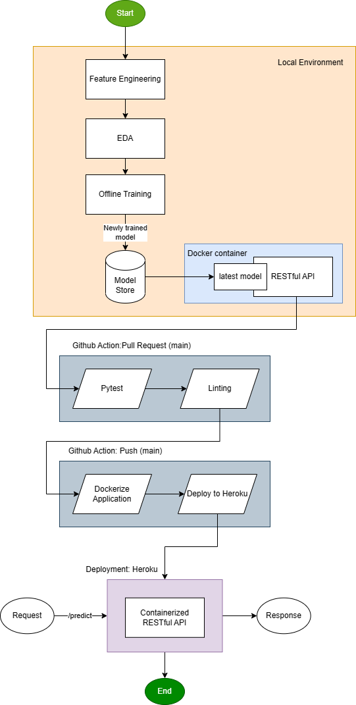

# Sales Prediction
Predict the sales given a set of inputs using only a single endpoint `/predict`

### File Structure
#### FastAPI
1. `/domain`: storage of the Schema
2. `/router`: layer for handling requests
3. `/service`: the name of the file is adapted from a clean architecture set up wherein the services are where the application and business logic is executed
4. `/tests`: consists of both functional and load test

#### Model Store
1. `/model_store`: it stores the latest model
2. `/archive`: storage of previously used model to mimic the functionality of versioning models

#### Data Store
1. `/data_store`: stores the training dataset, store details, and unscaled training dataset

#### Experiments
1. `/experiments`: makeshift isolated directory for conducting local testing, normally it should be isolated altogether from the deployment to reduce access of the training notebook and environment
2. `/utils`: stores the function for automatically saving the trained model in the Model Store

```
app
├── __init__.py
├── domain
│   ├── __init__.py
│   └── store.py
├── main.py
├── router
│   ├── __init__.py
│   ├── index.py
│   └── predict.py
├── service
│   ├── __init__.py
│   ├── model_loader.py
│   └── preprocessor.py
└── tests
    ├── __init__.py
    ├── functional_test
    │   ├── __init__.py
    │   ├── test_index.py
    │   └── test_predict.py
    └── load_test
        ├── __init__.py
        └── locustfile.py
        
data_store
├── store.csv
├── train.csv
└── x_train_unscaled.csv

model_store
├── archive
│   ├── sales_prediction_1.joblib
│   └── sales_prediction_2.joblib
└── sales_prediction_3.joblib

experiments
├── Experiment.ipynb
├── sales-prediction.joblib
└── utils
    └── services.py
```

## Basic System Design


## Usage
You may the application through heroku
1. Inference endpoint: https://sales-prediction.herokuapp.com/predict
2. API documentation endpoint: https://sales-prediction.herokuapp.com/docs

## References
- [Deploying Docker Image to Heroku using Github Action](https://blog.devgenius.io/how-to-deploy-to-kubernetes-heroku-using-docker-c2556a9584df)
- [Using Github SHA as tags for the docker image](https://github.com/marketplace/actions/docker-tags-action)
- [Commit message conventions](https://bitspeicher.blog/how-to-be-a-good-commitizen/)
- [Enforce Checks before Merging Pull Requests](https://docs.lacework.com/iac/enforce-merge-checks)
- [Designing Machine Learning Systems and Feature Engineering](https://www.amazon.com/Designing-Machine-Learning-Systems-Production-Ready/dp/1098107969)
- [MLE: One-hot encoding](https://www.amazon.com/Machine-Learning-Engineering-Andriy-Burkov/dp/1999579577)
- [Sudden change of base docker image from Alpine to slim](https://pythonspeed.com/articles/alpine-docker-python/)
